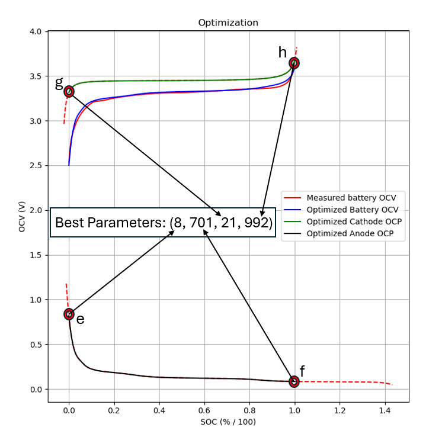
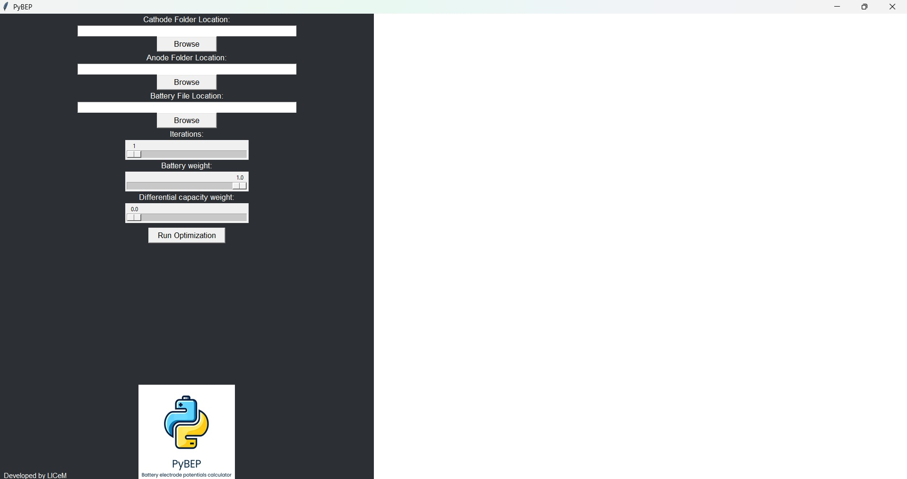
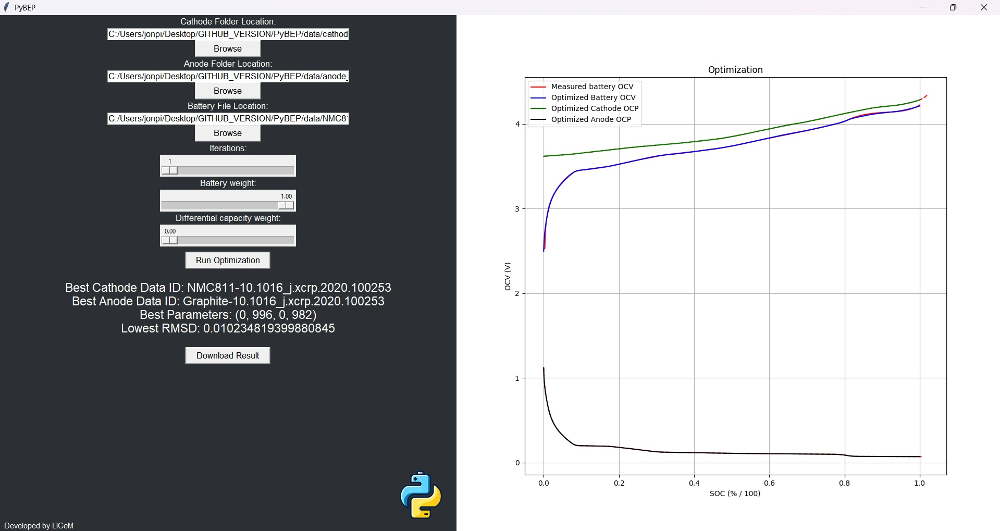

<!-- PROJECT LOGO -->
<br />
<div align="center">
    
</div>

<h3 align="center">BATTERY OCV DECOMPOSITION</h3>

<p align="center">
    Simple Python package with a built-in GUI that makes battery OCV decomposition a piece of cake.
    <br />
    <a href="https://github.com/JonPisek/package_directory"><strong>Explore the docs »</strong></a>
</p>

## About The Project

This project is brought to you by LICeM: Laboratory for Internal Combustion Engines and Electromobility, University of Ljubljana, Faculty of Mechanical Engineering (FME).

The aim of this project was to develop a program that automates the process of battery Open Circuit Voltage (OCV) decomposition. It achieves this by identifying the most suitable anode and cathode curves for decomposition and aligning them to the battery's State of Charge (SOC).

When considering cathode and anode Open Circuit Potential (OCP) curves, obtaining the battery OCV curve requires subtracting the anode OCP curve from the cathode OCP curve. However, the alignment of these curves is not straightforward due to differences in measurement methodologies. Anode OCP is measured based on anode SOC, while cathode OCP is based on cathode SOC. To align them with battery SOC, four parameters (e, f, g, h) are defined. Parameters e and f specify which anode OCP values align with battery SOC=0 and battery SOC=1, respectively. Similarly, parameters g and h perform the same alignment for cathodes.

For better clarity, consider the following illustration:

<div align="center">
    
</div>

For instance, if we have an array of 1001 anode OCP values, parameters e = 8 and f = 701 indicate that the 8th value in that array corresponds to SOC battery = 0, and the 701st value corresponds to battery SOC = 1.


<!-- GETTING STARTED -->
## Getting Started

This is an example of how you may give instructions on setting up your project locally.
To get a local copy up and running follow these simple example steps.

### Prerequisites

This is an example of how to list things you need to use the software and how to install them.
* npm
  ```sh
  npm install npm@latest -g
  ```

### Installation

1. Get a free API Key at [https://example.com](https://example.com)
2. Clone the repo
   ```sh
   git clone https://github.com/github_username/repo_name.git
   ```
3. Install NPM packages
   ```sh
   npm install
   ```
4. Enter your API in `config.js`
   ```js
   const API_KEY = 'ENTER YOUR API';
   ```


<!-- USAGE EXAMPLES -->
## Using the GUI

To utilize the GUI, simply run the `GUI.py` script, and you will be greeted with the following interface:

<div align="center">
    
</div>

The process is straightforward, explained from top to bottom:

1. **Cathode Folder Location** and **Anode Folder Location**: These locations are preset to be inside the data folder, but you can modify them as needed. It's recommended to leave the default settings. If you wish to contribute new half-cell curves, you can add them to the `anode_data` or `cathode_data` folders. For more information on importing additional half-cell data, refer to the files already present in these folders.

2. **Battery File Location**: Click "Browse" to select a TXT file from your computer. Ensure the format of your battery data matches the files stored in the data folder.

3. **Parameters**:
   - **Iterations**: The optimization calculates based on the mathematical method of differential evolution, which involves a certain amount of randomness. Higher iterations yield more consistent results but take longer to compute.
   - **Battery weight/Differential capacity weight**: The core function of this calculation is to determine the Root Mean Square Deviation (RMSD) value between measured battery data and calculated battery data (which is derived from aligned anode and cathode OCP values). By computing the derivatives of both sets of data and then calculating the reciprocal of these derivatives, we get what is known as the differential capacity of the battery. Differential capacity curves can sometimes aid in finding an optimal alignment for the anode and cathode. By adjusting the two parameters, you can specify the degree of influence each value will have on the final result.

Once you've defined all parameters, click "Run Optimization" to initiate the optimization process. After completion, you will see the calculated results:

<div align="center">
    
</div>

The GUI displays the name of the TXT file with the best cathode, best anode, parameters (e, f, g, h in that order), and the lowest calculated RMSD value. It also plots the results using Matplotlib.

After optimization, a "Download result" button appears. Clicking it allows you to choose where to save your result. The data is saved as a JSON file containing all the calculated data. For the format of the data, refer to an example under `results/test.json`. The button disappears after download and reappears when you run a new optimization.

Additionally, there's a theme toggle that changes the appearance of the GUI.

## Using `perform_full_optimization_parallel_to_json()` function

If you prefer not to use the GUI, you can directly use the `perform_full_optimization_parallel_to_json()` function. It accepts the same arguments explained in the Usage of the GUI section and returns the same JSON file obtained by pressing the "Download result" button in the GUI. For more information, refer to the `main_script.py` file, where you can see how to import and utilize the function.


<!-- CONTRIBUTING -->
## Contributing

Contributions are what make the open source community such an amazing place to learn, inspire, and create. Any contributions you make are **greatly appreciated**.

If you have a suggestion that would make this better, please fork the repo and create a pull request. You can also simply open an issue with the tag "enhancement".
Don't forget to give the project a star! Thanks again!

1. Fork the Project
2. Create your Feature Branch (`git checkout -b feature/AmazingFeature`)
3. Commit your Changes (`git commit -m 'Add some AmazingFeature'`)
4. Push to the Branch (`git push origin feature/AmazingFeature`)
5. Open a Pull Request


<!-- LICENSE -->
## License

Distributed under the MIT License. See `LICENSE.txt` for more information.


<!-- CONTACT -->
## Contact

Jon Pišek - jon.pisek@gmail.com

Project Link: [https://github.com/JonPisek/package_directory](https://github.com/github_username/repo_name)


<!-- ACKNOWLEDGMENTS -->
## Acknowledgments

* []()
* []()
* []()
