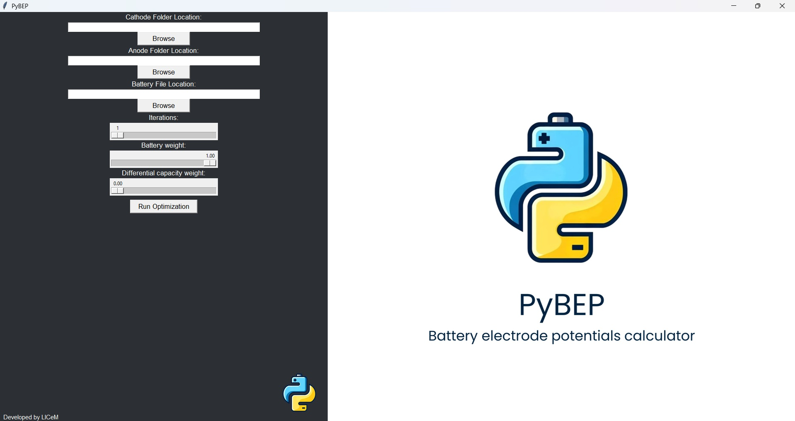
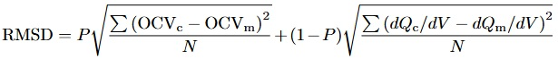

<!-- PROJECT LOGO -->
<br />

<div align="center">
    
</div>

<h3 align="center">Battery electrode potentials calculator</h3>

<p align="center">
    Simple Python package with a built-in GUI that makes battery OCV decomposition a piece of cake.
    <br />
    <a href="https://github.com/JonPisek/PyBEP"><strong>Explore the docs »</strong></a>
</p>

## About The Project

This project is brought to you by LICeM: Laboratory for Internal Combustion Engines and Electromobility, University of Ljubljana, Faculty of Mechanical Engineering (FME).

The aim of this project was to develop a program that automates the process of battery Open Circuit Voltage (OCV) decomposition. It achieves this by identifying the most suitable anode and cathode curves for decomposition and aligning them to the battery's State of Charge (SOC).

When considering cathode and anode Open Circuit Potential (OCP) curves, obtaining the battery OCV curve requires subtracting the anode OCP curve from the cathode OCP curve. However, the alignment of these curves is not straightforward due to differences in measurement methodologies. Anode OCP is measured based on anode SOC, while cathode OCP is based on cathode SOC. To align them with battery SOC, four parameters (e, f, g, h) are defined. Parameters e and f specify which anode OCP values align with battery SOC=0 and battery SOC=1, respectively. Similarly, parameters g and h perform the same alignment for cathodes.

For better clarity, consider the following illustration:

<div align="center">
    
</div>

For instance, if we have an array of 1001 anode OCP values, parameters e = 8 and f = 701 indicate that the 8th value in that array corresponds to SOC battery = 0, and the 701st value corresponds to battery SOC = 1.


<!-- GETTING STARTED -->
## Getting Started

Thank you for choosing our project! Follow the simple steps below to get started with the package:

### Prerequisites

Before installing the package, ensure you have the following prerequisites:

* Python 3.8 or higher

### Installation

1. Clone the repository:
   ```sh
   git clone https://github.com/JonPisek/PyBEP.git
   ```
   Alternatively, you can download the repository as a ZIP file and extract it to your desired location.

2. Navigate to the project directory:
   ```sh
   cd PyBEP
   ```

3. Install the package using `pip`:
   ```sh
   pip install .
   ```

### Usage

Once installed, you can easily launch the GUI for PyBEP:

1. Open a terminal or command prompt.
2. Navigate to the project directory if you haven't already.
3. Run the following command to launch the GUI:
   ```sh
   python -m src.OCV_GUI_module.GUI_from_terminal
   ```
   This command will open the GUI interface, allowing you to perform battery OCV decomposition effortlessly.

That's it! You're now ready to use the GUI for battery OCV decomposition analysis.


<!-- USAGE EXAMPLES -->
## Using the GUI

Using the GUI, you will be greeted with the following interface:

<div align="center">
    
</div>

The process is straightforward, explained from top to bottom:

1. **Cathode Folder Location** and **Anode Folder Location**: Click the "Browse" button under each bracket to choose your cathode and anode data folders. If you don't have your own data, you can access the `data` folder inside this project where you can find our data. If you wish to contribute new half-cell curves, you can add them to the `anode_data` or `cathode_data` folders.

⚠️ WARNING! Be very careful that there are no duplicated values in the data you upload. Duplicate entries will cause the code to crash or throw errors during execution.

For more information on importing additional half-cell data, refer to the files already present in these folders.

   Files should follow a specific naming structure:

   ### File Naming Convention

   - **Half-Cell Files:**

     ```
     <MaterialChemistry>-<DOI>
     ```

     Example: `NMC811-10.1016_j.xcrp.2020.100253`

   - **Full-Cell OCV Files:**

     ```
     <CathodeChemistry>vs<AnodeChemistry>_OCV-<DOI>
     ```

     Example: `NMC811vsGraphite_OCV-10.1016_j.xcrp.2020.100253`

   - **In-House Data:**

     ```
     <CathodeChemistry>vs<AnodeChemistry>_OCV-LICeM
     ```


   > ⚠️ Note: Replace `/` in DOI with `_` to ensure filename compatibility.


2. **Battery File Location**: Click the "Browse" button to select a TXT file from your computer. Ensure the format of your battery data matches the TXT files stored as examples in our `data` folder.

3. **Parameters**:
   - **Iterations**: The optimization calculates based on the mathematical method of differential evolution, which involves a certain amount of randomness. Higher iterations yield more consistent results but take longer to compute.
   - **Battery weight/Differential capacity weight**: The core function of this calculation is to determine the Root Mean Square Deviation (RMSD) value between measured battery data and calculated battery data (which is derived from aligned anode and cathode OCP values). By computing the derivatives of both sets of data and then calculating the reciprocal of these derivatives, we get what is known as the differential capacity of the battery. Differential capacity curves can sometimes aid in finding an optimal alignment for the anode and cathode. The RMSD is defined as:

<div align="center">
    
</div>

where P is the battery weight and (1-P) is the differential capacity weight, and:

<div align="center">
    
</div>

By adjusting the two parameters, P and (1-P), you can specify the degree of influence each term will have on the final result.

Once you've defined all parameters, click "Run Optimization" to initiate the optimization process. After completion, you will see the calculated results:

<div align="center">
    
</div>

The GUI displays the name of the TXT file with the best cathode, best anode, parameters (e, f, g, h in that order), and the lowest calculated RMSD value. It also plots the results using Matplotlib.

After optimization, a "Download result" button appears. Clicking it allows you to choose where to save your result. The data is saved as a JSON file containing all the calculated data. For the format of the data, refer to an example under `results/test.json`. The button disappears after download and reappears when you run a new optimization.

## Electrode Data Format and Preparation

All `.txt` data files used in this tool follow a standardized format:

| Column | Description                          |
| ------ | ------------------------------------ |
| 1      | Normalized lithiation level (x-axis) |
| 2      | Voltage vs. Li/Li⁺ (y-axis)          |

Each file contains **1001 points**.

### Data Source and Processing

1. **Interpolation**: LiionDB datasets were interpolated using NumPy to increase resolution.
2. **Symbolic Regression**: TuringBot, a symbolic regression software designed to generate mathematical formulas from data was used for modeling cathode OCP data. However, it encountered difficulties when modeling graphite anode OCP curves from LiionDB. Consequently, additional literature searches were conducted to obtain reliable data for the graphite anode curves.
3. **Manual Digitization**:
   - Images were imported into SolidWorks.
   - Curves were traced using spline tools.
   - Coordinates were exported via `.IGS` files and converted to `.txt` format.
   - Python was used for final interpolation and formatting.

## Using `perform_full_optimization_parallel_to_json()` function

If you prefer not to use the GUI, you can directly use the `perform_full_optimization_parallel_to_json()` function. It accepts the same arguments explained in the Usage of the GUI section and returns the same JSON file obtained by pressing the "Download result" button in the GUI. You can import the function from optimization_functons.py.

## ⚠️ Attention

This project is currently under active development. As a result, there may be temporary inconsistencies between the graphical user interface (GUI) and the instructions provided in this README.

We appreciate your understanding and encourage you to reach out if you notice any discrepancies or have questions. Your feedback is valuable and helps us improve the project.

<!-- CONTRIBUTING -->
## Contributing

Contributions are what make the open source community such an amazing place to learn, inspire, and create. Any contributions you make are **greatly appreciated**.

If you have a suggestion that would make this better, please fork the repo and create a pull request. You can also simply open an issue with the tag "enhancement".
Don't forget to give the project a star! Thanks again!

1. Fork the Project
2. Create your Feature Branch
3. Commit your Changes
4. Push to the Branch
5. Open a Pull Request


<!-- LICENSE -->
## License

Distributed under the MIT License. See `LICENSE.txt` for more information.


<!-- CONTACT -->
## Contact

Jon Pišek - jon.pisek@gmail.com

Project Link: [https://github.com/JonPisek/PyBEP](https://github.com/github_username/repo_name)

Developed by:
<div align="center">
  
</div>